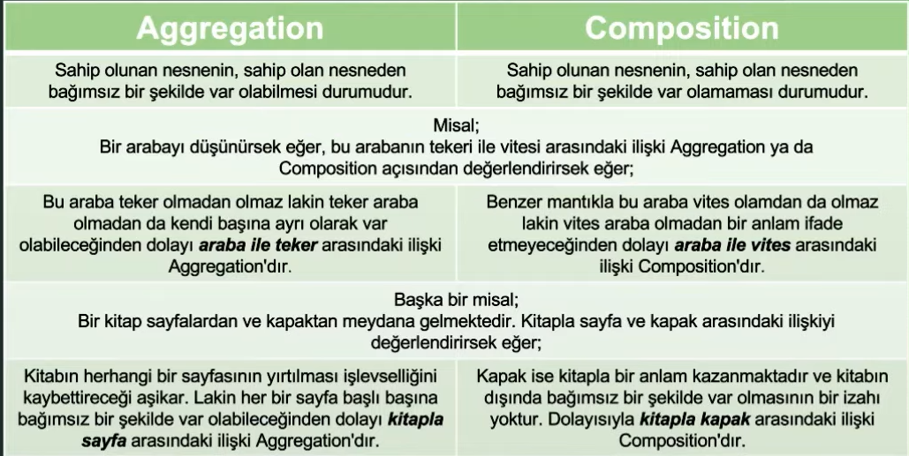

# **Nesneler Arası İlişki Türleri**

- Nesneler arasında terminolojik olarak nitelendirilebilir ilişki türleri mevcuttur. Bu ilişkiler; kalıtım, referans veya soyutlama gibi durumların getirisi olan mantıksal izahatlerdir.
- Nesneler arası ilişki türleri:
  - `is - a` ilişkisi
  - `has - a` ilişkisi
  - `can - do` ilişkisi

# **`is-a` İlişkisi Nedir?**

- `is-a` ilişkisi tamamiyle kalıtımla alakalıdır. C# programlama dilinde, iki sınıf arasında `:` operatörü ile gerçekletirilen kalıtım neticesinde ortaya bir `is-a` ilişkisi çıkacaktır.(woman is a human)

# **`has-a` İlişkisi Nedir?**

- Bir sınıfın başka bir sınıfın nesnesine dair sahiplik ifadesinde bulunan ilişkidir. Bir yandan `composition` ilişkisi de denmektedir.

- Örnek:
  Opel is a Car =>

```csharp
class Opel : Car
```

Opel has a engine =>

```csharp
{
    Engine engine;
}
```

==>

```csharp

class Opel : Car
{
    Engine engine;
}
```

# **`can-do` İlişkisi Nedir?**

- `Interface` yapılanmasının getirisi olan bir ilişki türüdür.
- Kısaca `interface`, bir sınıfın imzasıdır. Yani bir sınıfın içerisinde olacak olan tüm `member`'ların şablonunu/ara yüzünü oluşturduğumuz bir kontrattır.
- Herhangi bir `interface`'i uygulayan `class` o `interface` içerisinde tanımlanmış `member` imzalarını kendisinde oluşturmak zorundadır. Aksi taktirde compiler hata verecektir.

- `Interface`'ler içlerindeki `member`'ların imzalarını `class`'larda uygulattırdığından dolayı o `interface`'ler ilgili nesnenin yapabilecekleri kabiliyetleri göstermektedir.
- Yani `can-do` ilişkisi bir nesnenin davranışlarını/kabiliyetlerini belitmektedir.
- Bu kabiliyetler `interface` içinde tanımlanmaktadır.

# **`Association` Nedir?**

- Sınıflar arasındaki bağlantıların zayıf biçimine verilen addır.
- Bu bağlantı oldukça gevşektir. Sınıflar kendi aralarında ilişkilidir lakin birbirlerinden de bağımsızdılar.
- Parça bütün ilişkisi yoktur.

# **`Aggregation` ve `Composition` Nedir?**

- Nesneleri birleştirip daha büyük bir nesne yapmaya verilen isimlerdir.
- Yani her ikisi de birleştirilmiş nesnelerden bütünsel nesneler yapma durumlarını ifade eder.
- Her ikisinde de `Association`'da olmayan parça-bütün ilişkisi söz konusudur.
- Her iksinde de sahiplik ilişkisi(`has-a`) vardır.
  
